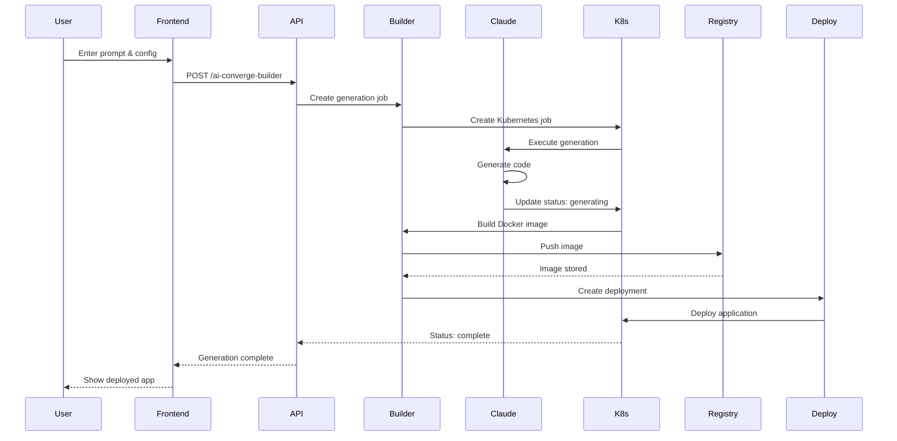
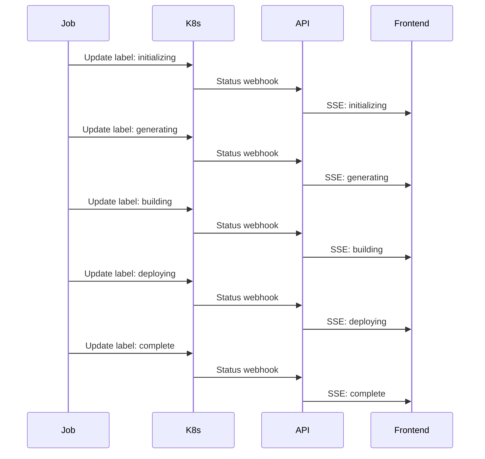

# Prompt to Real - AI Application Generation

## Overview

The Prompt to Real functionality is a revolutionary AI-powered application generation system within the NStarX platform that transforms natural language descriptions into fully functional, production-ready applications. This system leverages advanced Large Language Models (LLMs), specifically Claude's coding capabilities, combined with Kubernetes orchestration to automatically generate, build, deploy, and scale applications based on user prompts.

The system bridges the gap between business requirements and technical implementation by allowing users to describe what they want in plain English, and the platform handles the entire software development lifecycle - from code generation to deployment and monitoring. This democratizes application development, enabling both technical and non-technical users to create sophisticated applications without deep programming knowledge.

## Architecture

### System Components

#### Frontend Layer
- **Vue.js Application Interface**: Interactive UI for prompt input and configuration
- **AIAppGeneratorTab Component**: Main interface for application generation
- **Real-time Progress Tracking**: WebSocket-based updates on generation status
- **Preview and Configuration Panel**: Visual representation of generated applications

#### Backend Services
- **FastAPI Server**: High-performance async API handling generation requests
- **AI Converge Builder Service**: Core orchestration service for application generation
- **Claude Coding Agent**: LLM-powered code generation engine
- **Kubernetes Job Controller**: Manages generation jobs and build processes

#### Infrastructure Layer
- **Kubernetes Cluster**: Container orchestration and job management
- **MinIO Storage**: Object storage for generated code and artifacts
- **Container Registry**: Stores built application images
- **Deployment Manager**: Handles application deployment and scaling

### Data Flow Architecture

1. **User Input Phase**
   - User enters natural language prompt describing desired application
   - Selects application type (dashboard, API, ML model, etc.)
   - Chooses MCP (Model Context Protocol) tools for integration

2. **Processing Phase**
   - Request sent to AI Converge Builder API endpoint
   - Prompt processed and enhanced with context
   - Kubernetes job created with appropriate labels and configuration

3. **Generation Phase**
   - Claude Coding Agent generates application code
   - Code structured according to selected framework
   - Dependencies and configurations automatically created

4. **Build Phase**
   - Generated code containerized using Docker
   - Multi-stage builds for optimization
   - Image pushed to container registry

5. **Deployment Phase**
   - Kubernetes deployment created
   - Service and ingress configured
   - Auto-scaling policies applied

## Service Details

### AI Converge Builder Service

The AI Converge Builder is the core orchestration service that manages the entire application generation lifecycle:

#### API Endpoints

```python
POST /ai-converge-builder
{
    "app_name": "string",
    "prompt": "string",
    "branch": "string",
    "appTypes": "string"
}
```

#### Request Processing
1. **Validation**: Ensures app_name and prompt are valid
2. **Sanitization**: Converts app_name to Kubernetes-compliant format
3. **Job Creation**: Creates Kubernetes job with generation parameters
4. **Status Tracking**: Updates job labels with build status

#### Build Status States
- `initializing`: Job created and starting
- `generating`: AI generating application code
- `building`: Docker image being built
- `pushing`: Image being pushed to registry
- `deploying`: Application being deployed
- `complete`: Successfully deployed
- `failed`: Error occurred during process

### Claude Coding Agent

The Claude Coding Agent is responsible for the actual code generation:

#### Capabilities
- **Multi-language Support**: Generates code in Python, JavaScript, TypeScript, Go, etc.
- **Framework Awareness**: Creates applications using React, Vue, Flask, FastAPI, etc.
- **Best Practices**: Implements security, error handling, and performance optimizations
- **Documentation**: Generates inline comments and README files

#### Generation Process
1. **Context Analysis**: Understands user requirements from prompt
2. **Architecture Design**: Plans application structure
3. **Code Generation**: Creates source files and configurations
4. **Testing**: Generates unit and integration tests
5. **Documentation**: Creates setup and usage instructions

## Sequence Diagrams

### Application Generation Flow



### Build Status Update Flow



## Deployment Architecture

### Container Strategy
- **Multi-stage Builds**: Optimized images with minimal footprint
- **Layer Caching**: Faster rebuilds using Docker layer caching
- **Security Scanning**: Automated vulnerability scanning
- **Size Optimization**: Alpine-based images where possible

### Kubernetes Deployment
```yaml
apiVersion: apps/v1
kind: Deployment
metadata:
  name: generated-app-{app-name}
  labels:
    app: {app-name}
    generated-by: ai-converge-builder
spec:
  replicas: 3
  selector:
    matchLabels:
      app: {app-name}
  template:
    metadata:
      labels:
        app: {app-name}
    spec:
      containers:
      - name: app
        image: registry.nstarx.io/{app-name}:latest
        ports:
        - containerPort: 8080
        resources:
          requests:
            memory: "256Mi"
            cpu: "250m"
          limits:
            memory: "512Mi"
            cpu: "500m"
```

### Service Configuration
```yaml
apiVersion: v1
kind: Service
metadata:
  name: {app-name}-service
spec:
  selector:
    app: {app-name}
  ports:
  - port: 80
    targetPort: 8080
  type: LoadBalancer
```

## Scaling Architecture

### Horizontal Pod Autoscaling
```yaml
apiVersion: autoscaling/v2
kind: HorizontalPodAutoscaler
metadata:
  name: {app-name}-hpa
spec:
  scaleTargetRef:
    apiVersion: apps/v1
    kind: Deployment
    name: generated-app-{app-name}
  minReplicas: 2
  maxReplicas: 10
  metrics:
  - type: Resource
    resource:
      name: cpu
      target:
        type: Utilization
        averageUtilization: 70
  - type: Resource
    resource:
      name: memory
      target:
        type: Utilization
        averageUtilization: 80
```

### Scaling Policies
- **CPU-based**: Scale when CPU usage exceeds 70%
- **Memory-based**: Scale when memory usage exceeds 80%
- **Request-based**: Scale based on requests per second
- **Custom Metrics**: Scale based on application-specific metrics

## Application Lifecycle

### 1. Generation Phase
- **Duration**: 30-120 seconds
- **Activities**: Code generation, dependency resolution, configuration creation
- **Output**: Complete source code repository

### 2. Build Phase
- **Duration**: 60-180 seconds
- **Activities**: Docker build, dependency installation, compilation
- **Output**: Container image in registry

### 3. Deployment Phase
- **Duration**: 30-60 seconds
- **Activities**: Kubernetes resource creation, pod scheduling, health checks
- **Output**: Running application with public endpoint

### 4. Runtime Phase
- **Monitoring**: Prometheus metrics collection
- **Logging**: Centralized log aggregation
- **Health Checks**: Liveness and readiness probes
- **Updates**: Rolling updates with zero downtime

### 5. Maintenance Phase
- **Auto-scaling**: Based on load patterns
- **Self-healing**: Automatic pod restart on failure
- **Updates**: Automated security patches
- **Backups**: Regular state snapshots

## Supported Application Types

### 1. Web Applications
- **Dashboards**: Real-time data visualization
- **Admin Panels**: CRUD operations interfaces
- **E-commerce**: Shopping cart applications
- **Content Management**: Blog and CMS systems

### 2. API Services
- **REST APIs**: RESTful web services
- **GraphQL APIs**: GraphQL endpoints
- **Microservices**: Distributed service architecture
- **WebSocket Services**: Real-time communication

### 3. Data Applications
- **ETL Pipelines**: Data transformation workflows
- **Analytics Dashboards**: Business intelligence tools
- **Report Generators**: Automated reporting systems
- **Data Validators**: Quality assurance tools

### 4. AI/ML Applications
- **Model Servers**: ML model serving endpoints
- **Training Pipelines**: Automated model training
- **Inference APIs**: Prediction services
- **Data Labeling Tools**: Annotation interfaces

## MCP Tools Integration

### Available Tools
1. **Database Connectors**
   - PostgreSQL, MySQL, MongoDB
   - Redis, Elasticsearch
   - Time-series databases

2. **Message Queues**
   - RabbitMQ, Kafka
   - AWS SQS, Google Pub/Sub
   - Redis Pub/Sub

3. **Storage Systems**
   - S3-compatible storage
   - File systems
   - Blob storage

4. **External APIs**
   - Authentication services
   - Payment gateways
   - Third-party integrations

## Security Architecture

### Code Security
- **Dependency Scanning**: Automated vulnerability detection
- **Secret Management**: Kubernetes secrets for sensitive data
- **Code Analysis**: Static analysis for security issues
- **Runtime Protection**: Container security policies

### Network Security
- **Network Policies**: Restricted pod-to-pod communication
- **TLS Termination**: HTTPS endpoints with auto-renewal
- **API Gateway**: Rate limiting and authentication
- **Firewall Rules**: Ingress/egress restrictions

### Access Control
- **RBAC**: Role-based access control
- **Service Accounts**: Limited permissions per service
- **Audit Logging**: Complete audit trail
- **Multi-tenancy**: Isolated namespaces

## Monitoring and Observability

### Metrics Collection
- **Application Metrics**: Custom business metrics
- **System Metrics**: CPU, memory, disk, network
- **Performance Metrics**: Response time, throughput
- **Error Metrics**: Error rates and types

### Logging Architecture
- **Structured Logging**: JSON-formatted logs
- **Log Aggregation**: Centralized log storage
- **Log Analysis**: Pattern detection and alerting
- **Retention Policies**: Configurable log retention

### Distributed Tracing
- **Request Tracing**: End-to-end request tracking
- **Performance Analysis**: Bottleneck identification
- **Service Dependencies**: Dependency mapping
- **Error Tracking**: Error propagation analysis

## Cost Optimization

### Resource Optimization
- **Right-sizing**: Automatic resource adjustment
- **Spot Instances**: Use of spot instances where applicable
- **Reserved Capacity**: Reserved instance planning
- **Idle Resource Detection**: Automatic scale-down

### Build Optimization
- **Layer Caching**: Reduced build times
- **Parallel Builds**: Concurrent build processes
- **Incremental Builds**: Only rebuild changed components
- **Build Cache Sharing**: Shared cache across builds

## Best Practices

### Prompt Engineering
1. **Be Specific**: Provide detailed requirements
2. **Include Examples**: Give examples of desired behavior
3. **Specify Constraints**: Mention performance or security requirements
4. **Define Interfaces**: Describe API contracts or UI layouts

### Application Design
1. **Microservices**: Design for modularity
2. **Stateless**: Keep applications stateless
3. **12-Factor**: Follow 12-factor app principles
4. **Cloud-Native**: Design for cloud deployment

### Deployment Strategy
1. **Blue-Green**: Zero-downtime deployments
2. **Canary**: Gradual rollout
3. **Feature Flags**: Progressive feature enablement
4. **Rollback Plan**: Quick rollback capability

## Limitations and Considerations

### Current Limitations
- **Complexity**: Limited to medium complexity applications
- **Custom Libraries**: May not support all proprietary libraries
- **Legacy Systems**: Limited legacy system integration
- **Real-time Requirements**: Sub-millisecond latency not guaranteed

### Future Enhancements
- **Multi-cloud Support**: Deploy across cloud providers
- **Edge Deployment**: Support for edge computing
- **Mobile Apps**: Native mobile application generation
- **IoT Integration**: IoT device management capabilities

## Troubleshooting

### Common Issues
1. **Generation Timeout**: Increase timeout for complex applications
2. **Build Failures**: Check dependency compatibility
3. **Deployment Issues**: Verify resource quotas
4. **Performance Problems**: Review scaling configuration

### Debug Tools
- **Job Logs**: `kubectl logs job/{job-name}`
- **Pod Status**: `kubectl describe pod/{pod-name}`
- **Build Logs**: Container registry build logs
- **Application Logs**: Centralized logging dashboard

## API Reference

### Create Application
```http
POST /ai-converge-builder
Content-Type: application/json

{
  "app_name": "customer-dashboard",
  "prompt": "Create a real-time customer analytics dashboard with charts showing sales trends, customer demographics, and product performance. Include filters for date range and product categories.",
  "branch": "main",
  "appTypes": "dashboard"
}
```

### Check Status
```http
GET /ai-converge-builder/status/{job-name}

Response:
{
  "job_name": "ai-builder-customer-dashboard-abc123",
  "build_status": "deploying",
  "job_status": "Running",
  "container_statuses": [...],
  "deployment_url": "https://customer-dashboard.apps.nstarx.io"
}
```

### Get Application Details
```http
GET /converge-apps/{app-name}

Response:
{
  "name": "customer-dashboard",
  "status": "running",
  "url": "https://customer-dashboard.apps.nstarx.io",
  "resources": {...},
  "metrics": {...}
}
```

## Conclusion

The Prompt to Real functionality represents a paradigm shift in application development, making it accessible to everyone regardless of technical expertise. By combining the power of AI with robust cloud-native infrastructure, the platform enables rapid prototyping, development, and deployment of production-ready applications in minutes rather than months.