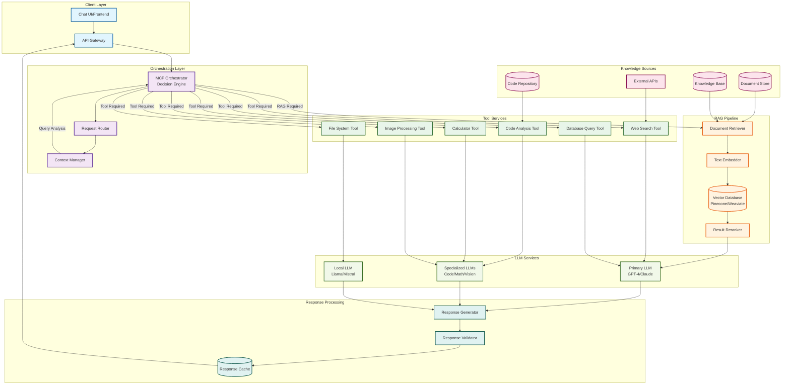

# Chat System Architecture with MCP and RAG Integration

## System Overview

This architecture demonstrates a modern chat system that leverages MCP (Model Context Protocol) as the central orchestrator for routing requests to appropriate services and tools, including RAG (Retrieval-Augmented Generation) capabilities.

## Architecture Diagram

## Component Descriptions

### MCP Orchestrator
The central decision engine that:
- Analyzes incoming queries
- Determines which tools/services to invoke
- Manages the flow between RAG and tool-based responses
- Coordinates multi-step workflows

### RAG Pipeline
- **Text Embedder**: Converts queries and documents to vector representations
- **Vector Database**: Stores and retrieves document embeddings
- **Document Retriever**: Fetches relevant documents based on similarity
- **Result Reranker**: Optimizes retrieved results for relevance

### Tool Services
Specialized tools that MCP can invoke:
- **Code Analysis**: Analyzes and generates code
- **Web Search**: Retrieves real-time information
- **Database Query**: Executes structured data queries
- **File System**: Manages local file operations
- **Calculator**: Performs complex calculations
- **Image Processing**: Handles vision-related tasks

### Response Flow
1. User query enters through Chat UI
2. API Gateway forwards to MCP Orchestrator
3. MCP analyzes query and decides on approach:
   - RAG for knowledge-based queries
   - Tools for specific actions
   - Direct LLM for general conversation
4. Selected services process the request
5. Response is generated, validated, and cached
6. Final response returned to user

## Key Features
- **Intelligent Routing**: MCP decides optimal path for each query
- **Hybrid Approach**: Combines RAG with tool-based responses
- **Multi-LLM Support**: Different LLMs for different tasks
- **Caching**: Improves response time for repeated queries
- **Extensible**: Easy to add new tools and services